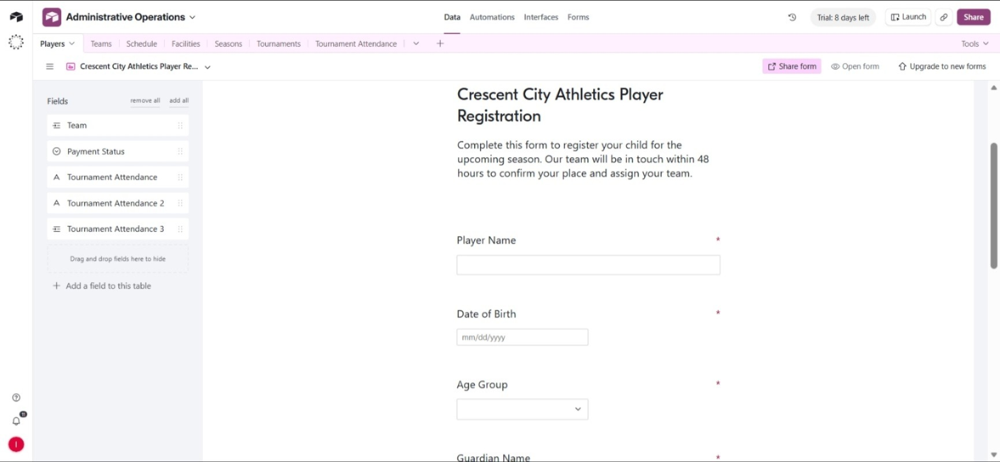
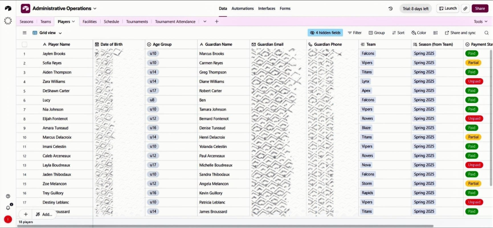
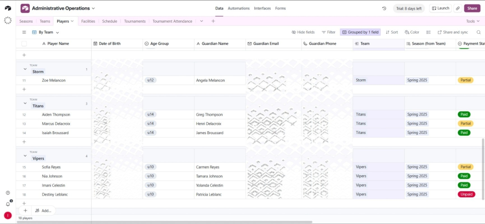
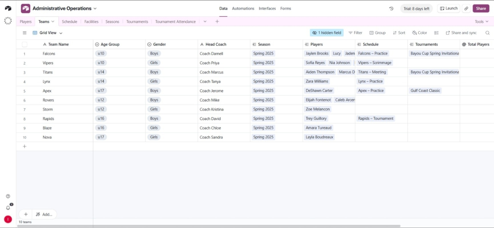
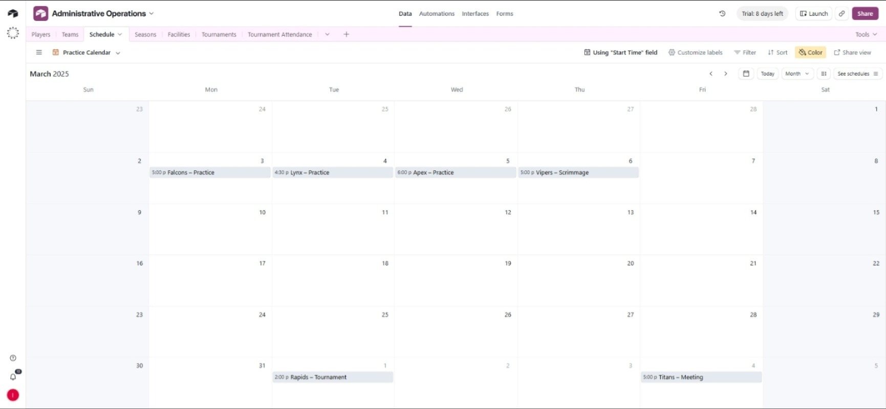
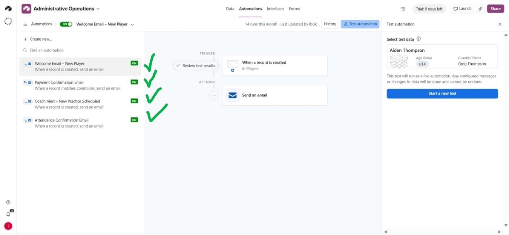
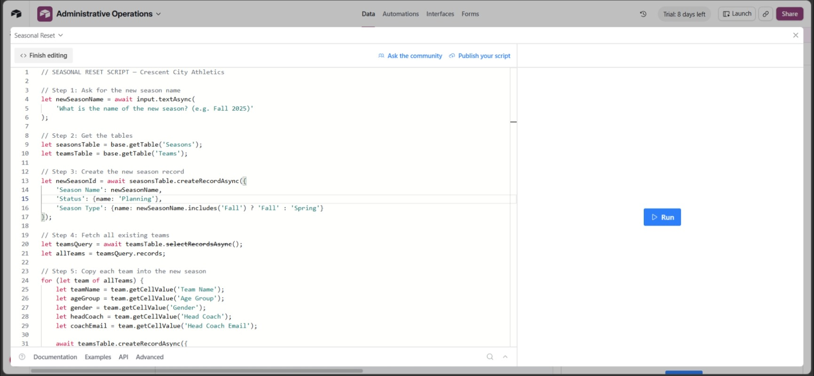

# Crescent City Athletics — Airtable Operations Platform

> A centralized operations system for a New Orleans youth soccer organization
> managing 14 travel teams, 18+ players, multi-facility scheduling,
> tournament logistics, and automated parent communications — all in Airtable.

---















## 🏟️ Project Overview

**Client:** Crescent City Athletics (New Orleans, LA)
**Role:** Airtable Architect & Operations Consultant

Crescent City Athletics was running travel soccer operations on a mix of spreadsheets, group chats, and manual emails. The pain points were clear:

- Seasonal resets took an **entire weekend** of manual data entry
- Payment statuses were tracked inconsistently across sheets
- Scheduling conflicts had **no detection system** in place
- Coaches received late or missed notifications about new practices
- Parents got no automated confirmation after registering their child

I designed and built a fully relational Airtable base from scratch — covering
every operational layer of the organization, with automations and scripting
to eliminate the manual admin burden.

> **Result:** Seasonal resets that once took a full weekend now complete
> in under 60 seconds at the click of a button.

---

## 🗂️ Database Architecture

The base is structured around six linked tables that mirror how the
organization actually operates:

### Tables

| Table | Purpose |
|---|---|
| **Players** | Player profiles, guardian contacts, age groups, payment status |
| **Teams** | Team roster, head coach, age group, gender, linked season |
| **Schedule** | Practice, scrimmage, meeting, and tournament events per team |
| **Facilities** | Venue details linked to schedule events |
| **Seasons** | Season records (Spring/Fall) with status tracking |
| **Tournaments** | Tournament entries linked to teams and seasons |
| **Tournament Attendance** | Tracks which players attend which tournaments |

---

## 📋 Player Registration

### Entry Point — Airtable Native Form

> "Crescent City Athletics Player Registration"

Parents complete a structured form capturing:

- Player Name & Date of Birth
- Age Group (auto-assigned bracket)
- Guardian Name, Email & Phone
- Team assignment
- Payment Status

✅ Form submission creates a new record in the **Players** table instantly
✅ Linked fields auto-connect the player to their **Team** and **Season**
✅ Guardian email is captured for all downstream automated communications

---

## 👥 Player & Team Views

### Grid View — Full Player Roster

> 18 players visible with payment status badges (Paid / Partial / Unpaid)

✅ Color-coded **Payment Status** field for instant visual scanning
✅ Hidden sensitive fields (DOB, phone) configurable per user role
✅ Linked **Team** and **Season** fields pull from relational tables

---

### Grouped View — Players by Team

> Same dataset, reorganized by Team for coach-level visibility

✅ Each team group shows headcount
✅ Recruiters and coaches see only their players
✅ Supports filtering by age group, payment status, or season

---

### Teams Table

> 10 teams across age groups u8 through u17 (Boys and Girls divisions)

Each team record contains:

- Team Name & Age Group
- Gender division
- Head Coach name
- Linked Season
- Linked Players (roster)
- Linked Schedule entries
- Linked Tournament entries
- **Total Players** (rollup formula — auto-calculated)

---

## 📅 Practice Calendar

> Airtable Calendar View — "Practice Calendar" using Start Time field

✅ Color-coded events per team
✅ Displays practice, scrimmage, tournament, and meeting event types
✅ March 2025 sample events:
  - `Mon Mar 3` — Falcons Practice (5:00 PM)
  - `Tue Mar 4` — Lynx Practice (4:30 PM)
  - `Wed Mar 5` — Apex Practice (6:00 PM)
  - `Thu Mar 6` — Vipers Scrimmage (5:00 PM)
  - `Tue Apr 1` — Rapids Tournament (2:00 PM)
  - `Sat Apr 5` — Titans Meeting (5:00 PM)

Facilities are linked to each event so venue conflicts surface automatically
when two teams are scheduled at the same location and time.

---

## ⚡ Automations

Four native Airtable automations fire without any external tools:

| Automation | Trigger | Action |
|---|---|---|
| **Welcome Email – New Player** | Record created in Players | Send welcome email to guardian |
| **Payment Confirmation Email** | Record matches conditions (Payment = Paid) | Send payment receipt to guardian |
| **Coach Alert – New Practice Scheduled** | Record created in Schedule | Notify head coach by email |
| **Attendance Confirmation Email** | Record created in Tournament Attendance | Confirm tournament registration to guardian |

> All four automations are **ON** and verified with live test runs.
> The Welcome Email automation logged **14 runs** in its most recent active month.

---

## 🖥️ Seasonal Reset Script

> Airtable Scripting block — "Seasonal Reset" for Crescent City Athletics

The most impactful single deliverable in this project.

### What it does:

```javascript
// Step 1: Prompts admin for the new season name (e.g. "Fall 2025")
// Step 2: Creates a new Season record with Status = Planning
// Step 3: Fetches all existing teams
// Step 4: Copies each team into the new season
//         (preserves Team Name, Age Group, Gender, Head Coach)
```

### Before vs. After

| Task | Before | After |
|---|---|---|
| Seasonal reset | Full weekend of manual entry | **Under 60 seconds** |
| New season record | Created manually | Auto-created with correct type |
| Team carry-over | Copy-paste each team | Loops all teams automatically |
| Human error risk | High | Eliminated |

### How to run:

1. Open the **Scripting** block in Airtable
2. Select `Seasonal Reset`
3. Click **▶ Run**
4. Enter the new season name when prompted (e.g. `Fall 2025`)
5. Done — all teams are copied into the new season instantly

---

## 🛠️ Tech Stack

| Tool | Purpose |
|---|---|
| **Airtable** | Core database, views, forms, automations, scripting |
| **Airtable Forms** | Parent-facing player registration |
| **Airtable Automations** | Email triggers for parents and coaches |
| **Airtable Scripting** | One-click seasonal reset logic |
| **Airtable Calendar View** | Visual scheduling across all teams |

No external tools, APIs, or third-party services required.
The entire system runs natively inside Airtable.

---

## ⚠️ Design Decisions

**Why native Airtable automations instead of Zapier or Make?**
Keeping automation inside Airtable reduces the dependency footprint. For
a volunteer-run sports organization, fewer tools means fewer things to
break and fewer credentials to manage.

**Why a scripting block for seasonal resets instead of a manual process?**
The previous process required a staff member to spend an entire weekend
duplicating records. A script is deterministic, instant, and error-free.
It also makes the organization less dependent on any single person knowing
the "reset process."

**Why link Players → Teams → Seasons relationally instead of flat tables?**
Flat tables break when you need multi-season historical data. The relational
model means you can query "who played on the Falcons in Spring 2025" without
ambiguity — and roll the organization forward each season without data loss.

---

## 🏁 Conclusion

This system gave Crescent City Athletics a **single source of truth** for
every part of their operation:

- ✅ Players and guardians tracked with payment visibility
- ✅ Teams organized by age group, gender, and season
- ✅ Scheduling conflicts surfaced through facility linking
- ✅ Parents notified automatically at every key moment
- ✅ Coaches alerted instantly when new practices are added
- ✅ Seasonal transitions completed in under 60 seconds

> Built to be maintained by non-technical staff.
> No code knowledge required to run day-to-day operations.