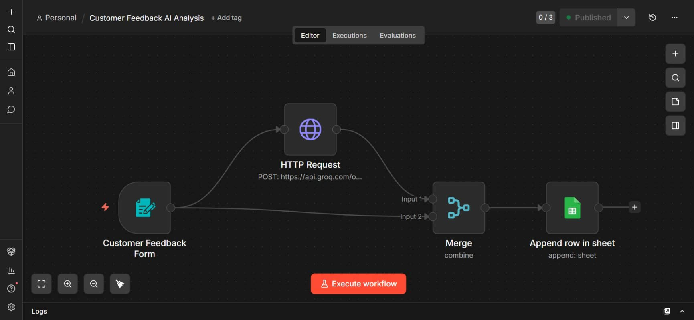

# Customer Feedback AI Analysis

## 1. Project Overview

**Customer Feedback AI Analysis** is an automation workflow built in n8n that collects customer feedback through a form, analyzes the sentiment using AI via the Groq API, and stores the results in Google Sheets for tracking and reporting.

This workflow automatically:

1. Collects feedback from customers via a form
2. Sends the feedback to an AI model for sentiment analysis
3. Labels the sentiment (Positive, Negative, etc.)
4. Flags urgent feedback
5. Saves everything into a Google Sheet

This creates a simple **AI-powered customer feedback tracking system**.

---

# 2. Workflow Architecture



## Workflow Flow

The workflow follows this sequence:

**Customer Feedback Form → AI Sentiment Analysis → Merge Data → Google Sheets**

### Nodes Used

| Node          | Purpose                                    |
| ------------- | ------------------------------------------ |
| Form Trigger  | Collect customer feedback                  |
| HTTP Request  | Send feedback to AI for sentiment analysis |
| Merge         | Combine AI result with form data           |
| Google Sheets | Store feedback and sentiment               |

---

# 3. Form Trigger – Customer Feedback Form

This node creates a public feedback form.

### Form Fields

The form collects the following information:

* Name
* Feedback Category (Product / Service / Other)
* Customer Feedback
* Contact Information

### Form Endpoint

The form is available at:

```
/customer-feedback
```

When a user submits the form, the workflow starts automatically.

### Data Generated by Form

The form outputs:

* Name
* What is your feedback about?
* Your feedback
* How can we contact you?
* submittedAt (timestamp)

---

# 4. AI Sentiment Analysis – HTTP Request Node

This node sends the feedback text to the Groq AI API for sentiment classification.

## API Used

Endpoint:

```
https://api.groq.com/openai/v1/chat/completions
```

## Model Used

```
llama-3.1-8b-instant
```

## Prompt Sent to AI

The AI receives this instruction:

```
Classify the sentiment of this customer feedback.
Respond with ONLY one word:
VERY_POSITIVE, POSITIVE, NEUTRAL, NEGATIVE, or VERY_NEGATIVE.

Feedback: [customer feedback]
```

## Example AI Responses

| Feedback                 | AI Output     |
| ------------------------ | ------------- |
| I love this product      | POSITIVE      |
| This service is terrible | VERY_NEGATIVE |
| It is okay               | NEUTRAL       |

The response is returned as:

```
$json.choices[0].message.content
```

---

# 5. Merge Node

The Merge node combines:

* Form data
* AI sentiment result

Mode used:

```
Combine → Combine By Position
```

This ensures the AI result is attached to the same feedback submission.

---

# 6. Google Sheets Storage

The final node appends a new row into Google Sheets.

## Stored Columns

| Column    | Value                     |
| --------- | ------------------------- |
| Timestamp | Form submission time      |
| Category  | Product / Service / Other |
| Feedback  | Customer feedback text    |
| Name      | Customer name             |
| Contact   | Contact info              |
| Source    | Form                      |
| Sentiment | AI sentiment result       |
| Urgent    | Yes if negative           |

## Urgent Logic

The workflow marks feedback as urgent if sentiment contains:

```
NEGATIVE
```

Expression used:

```
{{ $json.choices[0].message.content.includes('NEGATIVE') ? 'Yes' : 'No' }}
```

### Urgent Examples

| Sentiment     | Urgent |
| ------------- | ------ |
| VERY_NEGATIVE | Yes    |
| NEGATIVE      | Yes    |
| POSITIVE      | No     |
| NEUTRAL       | No     |

This helps teams quickly identify unhappy customers.

---

# 7. Example Final Google Sheet Row

| Timestamp  | Category | Feedback         | Name | Contact    | Source | Sentiment | Urgent |
| ---------- | -------- | ---------------- | ---- | ---------- | ------ | --------- | ------ |
| 2026-04-04 | Service  | Support was slow | John | john@email | Form   | NEGATIVE  | Yes    |

---

# 8. Setup Instructions

## Requirements

You need:

* n8n account
* Groq API Key
* Google Service Account
* Google Sheet

## Step-by-Step Setup

1. Import workflow JSON into n8n
2. Create HTTP Header Credential for Groq API

   ```
   Authorization: Bearer YOUR_GROQ_API_KEY
   ```
3. Connect Google Sheets credentials
4. Create a Google Sheet with columns:

   * Timestamp
   * Category
   * Feedback
   * Name
   * Contact
   * Source
   * Sentiment
   * Urgent
5. Activate workflow
6. Open form URL
7. Submit feedback
8. Check Google Sheets

---

# 9. Use Cases

This workflow can be used for:

* Customer feedback collection
* Product reviews analysis
* Support ticket sentiment tracking
* Employee feedback analysis
* Event feedback forms
* Complaint detection system

---

# 10. Possible Improvements

You can extend this workflow by adding:

* Email alerts for negative feedback
* Slack notifications
* Dashboard (Looker Studio)
* Automatic reply to customers
* Feedback categorization using AI
* Priority scoring
* Weekly sentiment reports

---

# 11. Workflow Summary

## What This Automation Does

1. Customer submits feedback form
2. Workflow sends feedback to AI
3. AI classifies sentiment
4. Workflow flags urgent feedback
5. Data saved to Google Sheets
6. Company can track customer satisfaction automatically

---

# 12. Simple Architecture Diagram

```
Customer
   ↓
Feedback Form
   ↓
AI Sentiment Analysis (Groq)
   ↓
Merge Data
   ↓
Google Sheets Database
```

---

# 13. Final Description (For Portfolio / Documentation)

**Customer Feedback AI Analysis** is an automated feedback processing system built with n8n that collects customer feedback through a form, analyzes sentiment using AI, flags urgent negative feedback, and stores structured results in Google Sheets for reporting and customer experience monitoring.